# NUR AIMAN AFZAN BIN AZHAR


# ScaleForecast: Multi-Technique Demand Forecasting Engine

###  *ITT440 - INDIVIDUAL ASSIGNMENT*

**NAME : NUR AIMAN AFZAN BIN AZHAR**

**STUDENT ID : 2025226838**

**GROUP : M3CS2554C**

**GITHUB LINK : [ITT440 - GITHUB](https://github.com/aimanafzans/scaleforecast)**

**YOUTUBE LINK : [ITT440 - INDIVIDUAL ASSIGNMENT](https://youtu.be/VqJLgOwQ_0E)**

---

ScaleForecast is a command-line, menu-driven e-commerce demand forecasting application. It is a genuine inventory-forecasting tool — generating synthetic SKU sales datasets, computing restock recommendations, and flagging at-risk-of-stockout products — that also doubles as a controlled experiment comparing four Python execution strategies on the same CPU-bound workload:

| # | Technique | Execution model |
|---|---|---|
| 1 | **Sequential** | Single-threaded baseline |
| 2 | **Concurrent (With GIL)** | `threading`, standard CPython (GIL enabled) |
| 3 | **Concurrent (No GIL)** | `threading`, free-threaded CPython 3.13 build (PEP 703, GIL disabled) |
| 4 | **Multiprocessing** | `multiprocessing.Pool` / `ProcessPoolExecutor` |

The project demonstrates — with real benchmark data and charts — why GIL-bound threading gives no real speedup for CPU-bound work, while free-threaded (no-GIL) threading and multiprocessing do, along with the overhead tradeoffs multiprocessing carries at small data volumes.

---

## Table of Contents

- [Features](#features)
- [Architecture](#architecture)
- [Installation](#installation)
- [Usage](#usage)
- [Screenshots](#screenshots)
- [Benchmark Methodology](#benchmark-methodology)
- [Results](#results)
- [Forecasting Logic](#forecasting-logic)
- [Project Structure](#project-structure)
- [Regenerating the Screenshots / Charts Yourself](#regenerating-the-screenshots--charts-yourself)

---

## Features

- **Synthetic SKU dataset generator** — 5 volume tiers (10K → 2M SKUs) plus a custom count, with per-category sales-pattern simulation (stable, seasonal-variance, and high-variance/spike categories) and a realistic days-of-supply model for starting stock.
- **Demand forecasting engine** — 7-day / 30-day moving averages, volatility (coefficient of variation), safety stock, reorder point, and a 4-tier stockout-risk classification (Critical / High / Medium / Low), computed identically across all four execution techniques.
- **Dataset & report management** — list, inspect, and delete generated datasets and forecast reports directly from the CLI.
- **Performance benchmark suite** — times all four techniques on the same dataset, reporting wall time, speedup, parallel efficiency, throughput, CPU utilization, memory footprint, and process/thread setup overhead.
- **Chart generation** — `matplotlib` charts (speedup vs. size, throughput vs. size, efficiency vs. size, time vs. size, CPU utilization, memory, and overhead breakdown) generated automatically after each benchmark run.
- **Rich terminal UI** — styled menus, tables, and progress bars via the `rich` library.

---

## Architecture

```
scaleforecast/
├── main.py                    # CLI entry point
├── cli/
│   ├── app.py                 # Main menu loop and dispatch
│   ├── console.py             # Shared rich Console + theme
│   ├── components.py          # Reusable rich renderers (menus, tables, panels)
│   ├── session.py             # In-memory session state (last dataset, etc.)
│   └── controllers/           # One controller per menu option
│       ├── generate.py        # Option 1 — Generate Mock SKU Dataset
│       ├── manage.py          # Option 2 — Manage / Delete Datasets
│       ├── forecast.py        # Option 3 — Run Demand Forecast
│       ├── reports.py         # Option 4 — View Forecast Reports
│       └── benchmark.py       # Option 5 — Run Performance Benchmark
├── data_generator.py          # Synthetic SKU dataset generation
├── data_manager.py            # List / delete datasets
├── forecast_engine.py         # Core forecasting computation (shared by all techniques)
├── interpreter_detection.py   # GIL status detection, interpreter discovery, technique availability
├── _runner.py                 # Standalone subprocess runner used by the benchmark for all 4 techniques
├── executors/
│   ├── sequential.py          # Single-threaded baseline
│   ├── concurrent_gil.py      # threading-based executor
│   ├── concurrent_nogil.py    # Re-exports concurrent_gil, run under python3.13t
│   └── parallel_multiprocessing.py
├── benchmark.py                # Orchestrates multi-technique timed runs + metrics
├── metrics_collector.py        # CPU / memory / timing helpers
├── report_generator.py         # Forecast reports (restock recs, at-risk SKUs)
├── chart_generator.py          # matplotlib chart outputs for benchmark results
├── data/                       # Generated datasets (CSV, git-ignored)
├── reports/                    # Generated forecast reports (CSV, git-ignored)
└── benchmarks/                 # Benchmark result tables + charts (git-ignored)
```

**Why every technique runs as a subprocess:** the GIL state is fixed per-process at interpreter startup, so it can't be toggled per function call. All four techniques are dispatched via `_runner.py` with an explicitly pinned interpreter — Sequential, Concurrent (With GIL), and Multiprocessing always run under the standard CPython build, while Concurrent (No GIL) is the only technique that runs under the free-threaded `python3.13t` build. This keeps the baseline timing consistent regardless of which interpreter launches the main menu app.

---

## Installation

### Requirements

- **Python 3.13+** (standard build) — required to run the app itself.
- **Python 3.13t** (free-threaded build) — optional, only needed to unlock the "Concurrent (No GIL)" benchmark technique.
  - Windows: `winget install Python.Python.3.14` for the standard interpreter, plus the free-threaded installer from [python.org](https://www.python.org) (check "Include free-threaded binaries").
  - Without it, the app still runs fully — Concurrent (No GIL) is simply shown as unavailable in the technique menu.

### Setup

```bash
git clone https://github.com/aimanafzans/scaleforecast.git
cd scaleforecast
pip install -r requirements.txt
```

### Run

```bash
python -m scaleforecast.main
```

---

## Usage

Launch the app and pick an option from the main menu:

1. **Generate Mock SKU Dataset** — choose a volume tier (10K / 100K / 500K / 1M / 2M) or a custom count, category distribution, and optional random seed.
2. **Manage / Delete Datasets** — view and remove generated dataset files.
3. **Run Demand Forecast** — pick a dataset and an execution technique, and produce a restock/at-risk report.
4. **View Forecast Reports** — browse past reports, drill into category summaries, at-risk SKUs, and restock recommendations.
5. **Run Performance Benchmark** — time all four techniques on a chosen dataset and generate comparison charts.
6. **Exit**

---

## Screenshots

> All screenshots below were captured directly from the running application, using real generated datasets and real benchmark results — nothing here is mocked.

### Main menu

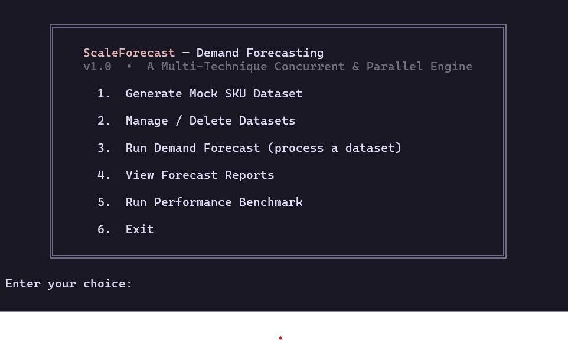

### Dataset listing (Option 1 / 2 / 3)

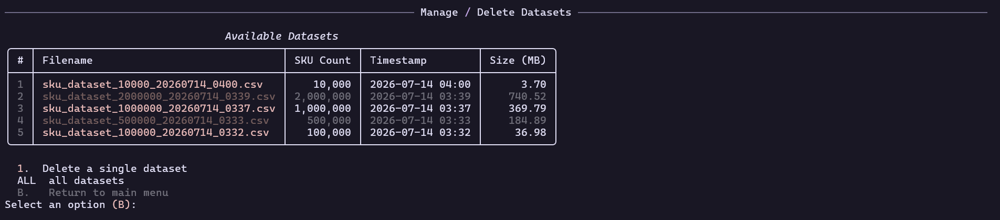

### Execution technique selection (Option 3)

Note "Concurrent (No GIL)" is greyed out here because this machine only had the standard CPython interpreter installed — this is the app's real availability-detection behaviour, not a mockup.

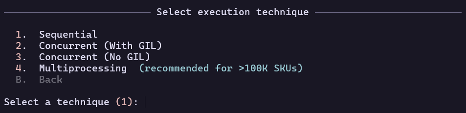

### Forecast reports listing (Option 4)

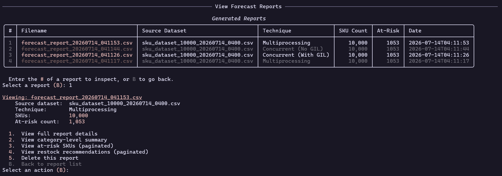

### Benchmark results — 10,000 SKUs (Option 5)

At small volumes, Multiprocessing's process-startup overhead outweighs its parallel gains, and GIL-bound threading gives essentially no speedup.

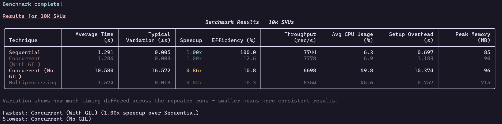

### Benchmark results — 2,000,000 SKUs (Option 5)

At large volumes, both no-GIL threading and multiprocessing clearly pull ahead of the sequential baseline, while GIL-bound threading stays flat.

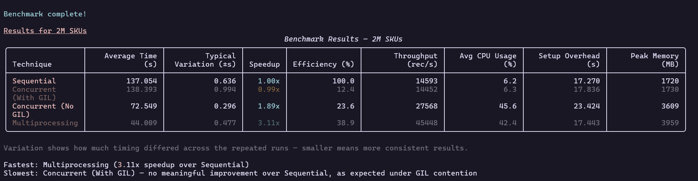

---

## Benchmark Methodology

Each benchmark run repeats every technique multiple times per dataset and reports the average plus variation, alongside:

- **Speedup** — sequential time ÷ technique time
- **Efficiency** — speedup ÷ number of workers, as a percentage
- **Throughput** — records processed per second
- **CPU utilization** — average CPU usage across all cores during the run
- **Setup overhead** — time spent spinning up threads/processes before computation starts
- **Peak memory** — highest RSS memory observed during the run

Datasets are benchmarked across all five volume tiers (10K, 100K, 500K, 1M, 2M SKUs) to expose how each technique's relative performance shifts with data volume.

---

## Results

Charts below are generated automatically by `chart_generator.py` after a benchmark run, aggregating results across all volume tiers.

### Speedup vs. dataset size

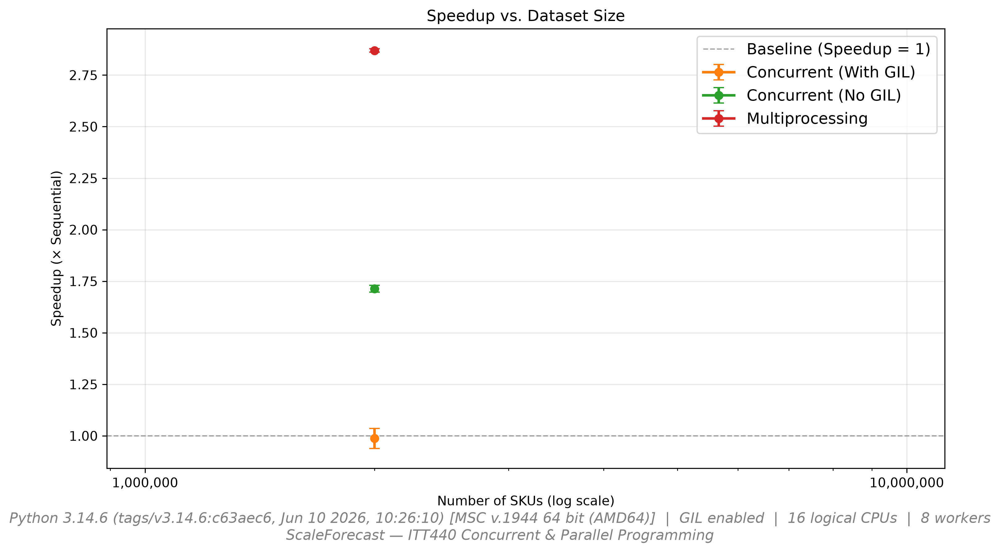

### Throughput vs. dataset size

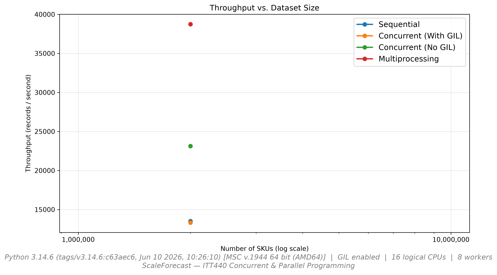

### Parallel efficiency vs. dataset size

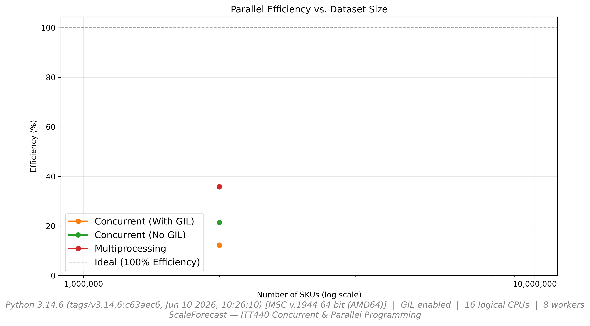

### Wall-clock time vs. dataset size

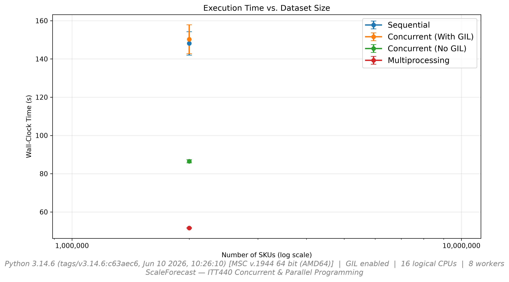

### CPU utilization by technique

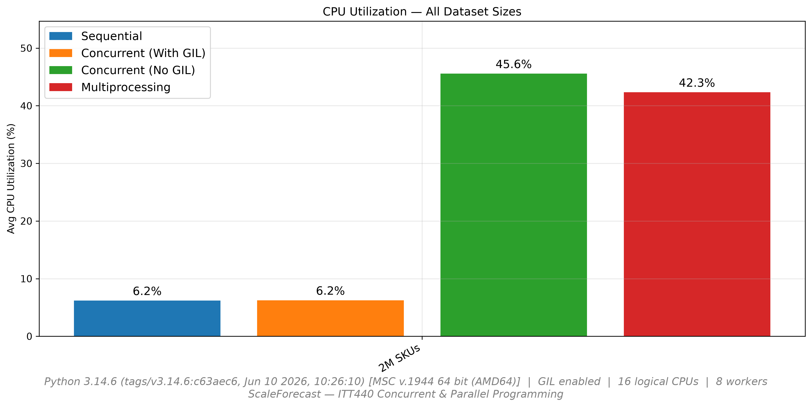

### Peak memory by technique

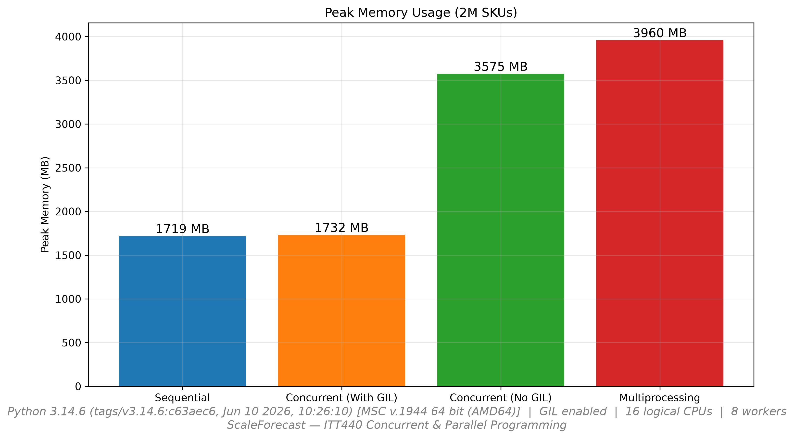

### Setup overhead breakdown

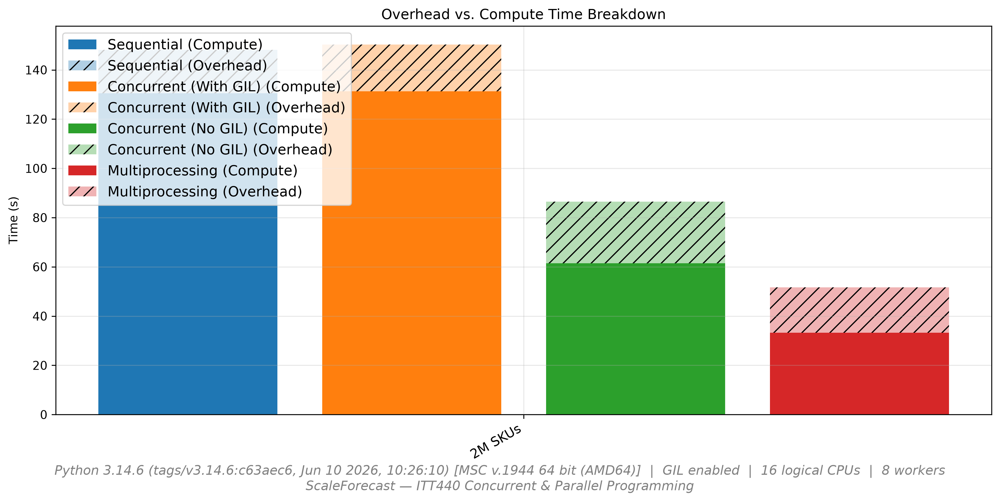

### Summary (2,000,000 SKUs)

| Technique | Avg Time (s) | Speedup | Efficiency | Throughput (rec/s) | Peak Memory (MB) |
|---|---|---|---|---|---|
| Sequential | 148.12 | 1.00x | 100.0% | 13,518 | 1,719.4 |
| Concurrent (With GIL) | 150.29 | 0.99x | 12.3% | 13,329 | 1,732.5 |
| Concurrent (No GIL) | 86.47 | 1.71x | 21.4% | 23,131 | 3,575.4 |
| Multiprocessing | 51.62 | **2.87x** | 35.9% | **38,746** | 3,960.1 |

**Takeaway:** GIL-bound threading provides no meaningful improvement over the sequential baseline for this CPU-bound workload, as expected under GIL contention. Free-threaded (no-GIL) threading and multiprocessing both scale, with multiprocessing giving the strongest speedup at large data volumes — at the cost of higher memory usage from worker process overhead.

---

## Forecasting Logic

For each SKU, the engine computes:

- **7-day and 30-day moving averages** of daily sales
- **Volatility** — coefficient of variation of the daily sales series
- **Safety stock** — based on demand standard deviation, lead time, and a service-level z-score
- **Reorder point** — `(average daily demand × lead time) + safety stock`
- **Stockout risk** — Critical / High / Medium / Low, based on current stock vs. reorder point and volatility

This same computation runs identically across all four execution techniques — only the parallelization strategy differs, not the forecasting logic itself.

---

## Project Structure

See [Architecture](#architecture) above for the full module layout.

---

## Regenerating the Screenshots / Charts Yourself

The screenshots and charts in this README were produced from real runs of the app. To regenerate them on your own machine (e.g. after a UI change):

1. **Dataset & technique menu screenshots** — run `python main.py`, and on Windows/macOS/Linux use your terminal's built-in screenshot tool:
   - **Windows Terminal**: `Win + Shift + S` (Snipping Tool) after navigating to the relevant screen.
   - **macOS Terminal/iTerm**: `Cmd + Shift + 4` then `Space` to snap the terminal window.
   - **Linux**: `gnome-screenshot` / `flameshot` / your desktop environment's screenshot shortcut.

   Recommended screens to capture:
   - Main menu (right after launch)
   - Option 1 → after a dataset finishes generating (shows the summary line)
   - Option 3 → the technique selection list
   - Option 4 → the reports table, and one drill-down (e.g. at-risk SKUs)
   - Option 5 → the results table after a benchmark completes, ideally once for a small tier (10K) and once for a large tier (1M or 2M) to show the performance divergence

2. **Charts** — run Option 5 (Run Performance Benchmark) against each volume tier; `chart_generator.py` writes PNGs to `scaleforecast/benchmarks/<run_id>/`. Copy the ones you want into `assets/`.

3. For a wider terminal window (so tables don't wrap awkwardly in the screenshot), maximize the terminal or set its column width to ~120 before capturing.
